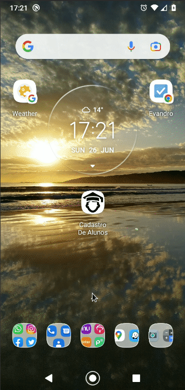

# Student Registration

Developed to gain knowledge and train android development with java.

The app has two screens, one has a simple form for student registration, saving in a sqlite database on android. The other screen displays a list of students already registered.

Executado de acordo com essa playlist do youtube [click aqui](https://www.youtube.com/watch?v=2xGwbstHwrA&list=PLW3TB55ahKKM8gu6LzgMPz55TOqcY62dJ&index=2&ab_channel=IvanPaulinoPereira).

 <a href="assets/student-registration_1.0.apk" download>Click to Download the app</a>



To clone the project with SSH:

```
git clone git@github.com:evandroad/student-registration.git
```

To clone the project with HTTP:

```
git clone https://github.com/evandroad/student-registration.git
```
